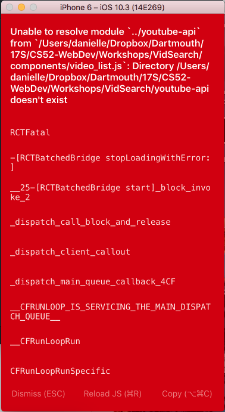
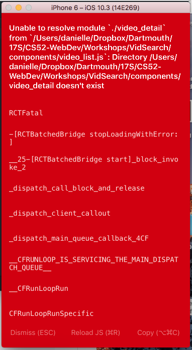
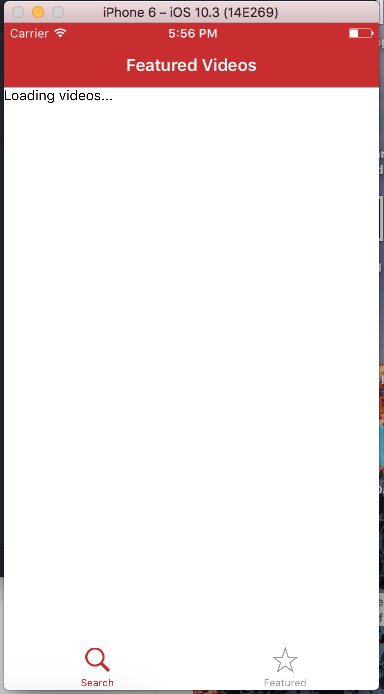
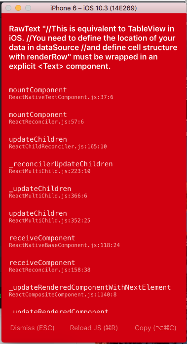
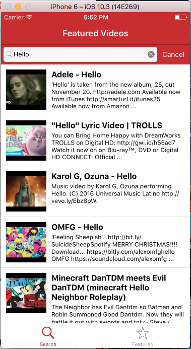

# react-native-workshop

Workshop done on 5/16 on React Native based on the instructions found [here](https://github.com/arinehouse/react-native-workshop).

## Screenshots
### Midpoint Screenshot
Here is the screenshot that I took after setting up the VideoList component.

.

As you can see, there was an error due to the import of `youtube-api.js`, a file which did not yet exist.
After I commented out that import statement, I took the following screenshot.

.

Again, there was an error due to the import of a file which did not yet exist.
After I commented out the line that imported `video_detail.js`, I took the following screenshot.

.

### Final Result Screenshot
At the end of the workshop, I got the following screenshot.

.

As you can see there is an error in the code. After I removed the comments on lines 141-143 of `video_list.js`, I took the following final screenshot.

.
